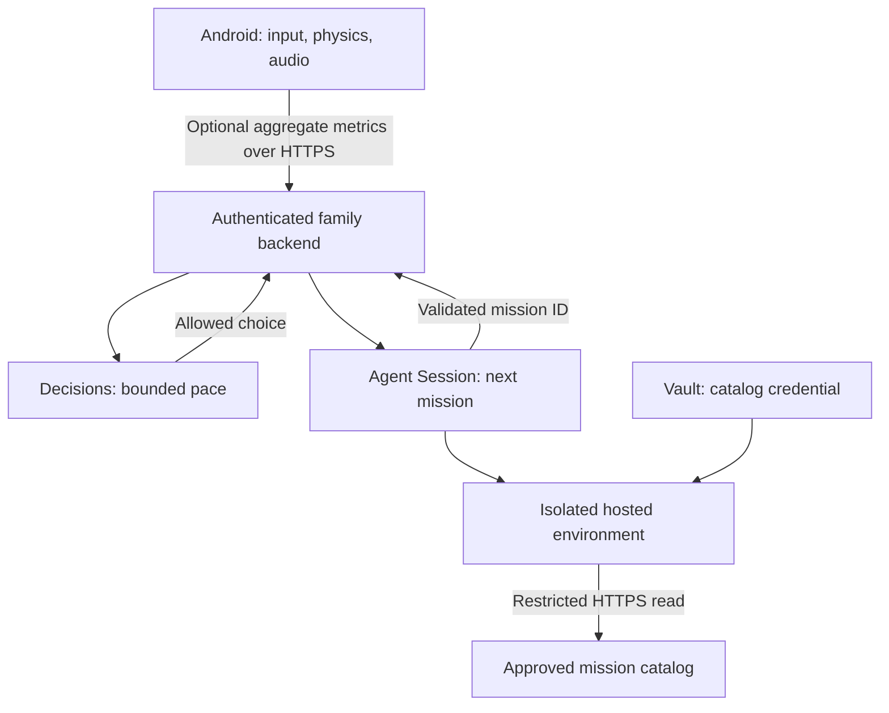

# LUMI Orbit

A small, joyful Android vector arcade game for children. Built for portrait, one-finger play, short rounds, and local responsiveness.

**Delivery status — v0.1.0:** the signed APK and offline game are implemented. OpenAI adapters are implemented against official documentation and tested with fixtures. **No live OpenAI calls, hosted backend, vault, or managed session have been activated in this delivery.** Account credentials and a public HTTPS backend are still required. This is a family pilot, not a production service or Play Store launch.

## Play

- Drag anywhere in the playfield to move the ship. Shooting and aim assistance are automatic.
- Approach golden stars to rescue them. Rescue eight stars to complete the expedition.
- Tap the shield for three seconds of protection. It recharges in ten seconds.
- A round ends after 60 seconds, eight stars, or three collisions. Every ending encourages another try.
- Three mission patterns: star garden, comet stream, moon rings.
- Original synthesized sound, procedural vector graphics, optional reduced effects, local progress.
- Android 9+; portrait; no accounts, ads, trackers, microphone, location, camera, purchases, or web content.

## What each OpenAI service does

| Service | Implementation | Runtime boundary |
|---|---|---|
| Decisions | `POST /v1/decisions`, `gpt-6-luna`, typed `choice` answer | At most two requests per round, ahead of wave boundaries; bounded difficulty changes |
| Agent Session | A managed mission-planning session per connected expedition | Created asynchronously; final message accepted only after a completed root turn |
| Environment | `openai_hosted`, `small`, restricted network | Agent reads approved mission catalog; no model-generated code runs on the phone |
| Vault | Environment-variable credential for read-only `/catalog` | Actual secret injected by the OpenAI proxy only for the allowlisted HTTPS host |
| APK | Offline physics and rendering | Never contains the OpenAI key; optional backend token encrypted with Android Keystore |

The Vault stores the **catalog token**, not player progress and not the OpenAI application key. The application key stays only in the backend secret manager.

The managed agent selects a mission from an approved catalog. It does not invent unrestricted children's content. The selected mission is queued for the next round, so provider latency cannot interrupt the current game. Decisions selects `gentle`, `steady`, or `bright`. Local code owns all numeric bounds and applies the change between waves. Offline rules remain available on timeouts, refusals, quota errors, or missing setup; the parent area reports the real connection status.



## Source map

- `app/src/main/assets/`: actual shipped Canvas game, CSS, HTML.
- `app/src/main/java/com/edward/lumi/MainActivity.java`: Android shell, system-bar insets, lifecycle, encrypted connection token, fixed-path HTTPS bridge.
- `server/provider.py`: documented OpenAI REST contracts and strict result validation.
- `server/app.py`: authenticated API, SQLite budgets, asynchronous planning, cleanup and sanitized audit.
- `server/provision.py`: one-time Vault and catalog credential provisioning.
- `server/catalog.json`: approved mission catalog.
- `tests/test_backend.py`: 13 contract and HTTP tests with a fake provider, never live API traffic.
- `docs/operations.md`: deployment boundary, configuration, retention, and acceptance criteria.
- `scripts/build.sh`: dependency-free Android compilation and release signing.

## Build and test

Requires JDK 17+, Android platform API 35+, Android build tools 35+, Python 3.10+, and a private signing keystore. No Gradle, game engine, npm dependencies, or network access are needed by the build after those tools are available.

```bash
python3 -m unittest discover -s tests -v
node --check app/src/main/assets/game.js
# Set ANDROID_JAR, BUILD_TOOLS, LUMI_KEYSTORE, LUMI_STOREPASS in the build environment.
# The signing key alias is lumi; signing material must stay outside this repository.
bash scripts/build.sh
```

The APK is written to `build/LUMI-Orbit-v0.1.0.apk`. The delivered release is signed with its own persistent key, not the Android debug key. Private signing backup is retained separately from this public repository. CI requires the matching signing secrets to produce updates compatible with the delivered APK.

For a browser preview, serve `app/src/main/assets/` with a local HTTP server. The same game files run in the Android WebView. Native integration settings are available only in the APK.

## Verification

- APK compiled against API 36, minimum API 28, target API 35; signing verified by `apksigner`.
- Browser UI tested at 390×820, 360×640, and 1200×800.
- Start, drag movement, shield/recharge, pause/resume, parent gate, round completion, replay reset, saved progress and layout checked; no app console errors after fixes.
- Backend test suite: 13 passing tests, all using fixtures.
- No physical Android-device/emulator run and no live OpenAI integration test have been performed. Do not infer those from the build or fixture tests.

## Official references

Contracts checked on 2026-10-07:

- [Decisions](https://developers.openai.com/api/docs/guides/decisions)
- [Agents quickstart](https://developers.openai.com/api/docs/guides/agents-api/quickstart)
- [Sessions](https://developers.openai.com/api/docs/guides/agents-api/sessions)
- [Events and completed turns](https://developers.openai.com/api/docs/guides/agents-api/sessions/events)
- [Hosted environments](https://developers.openai.com/api/docs/guides/agents-api/environments/openai-hosted)
- [Vault credentials](https://developers.openai.com/api/docs/guides/agents-api/tools/vaults)

MIT. Vector art, game design, and synthesized audio created for this project.
